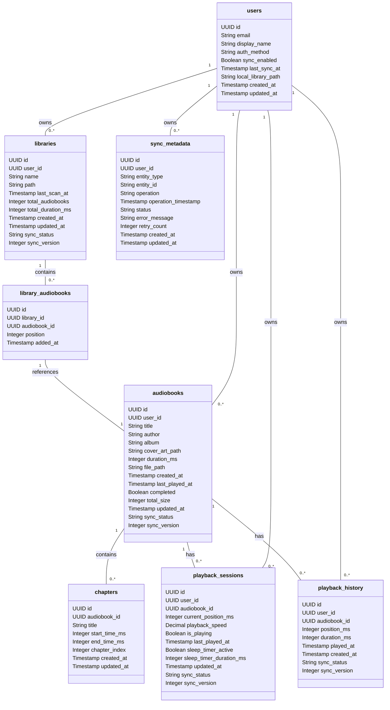
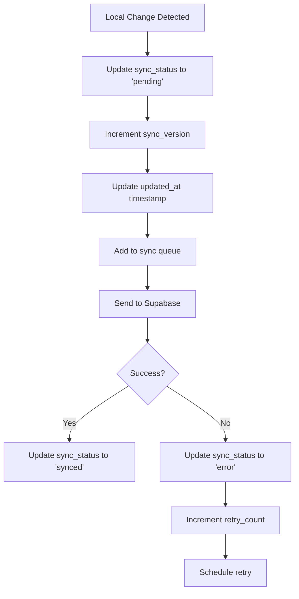
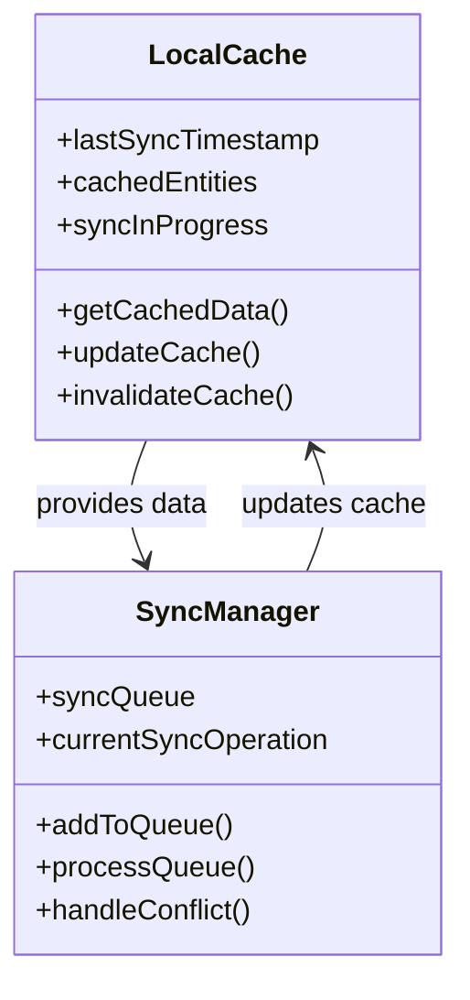
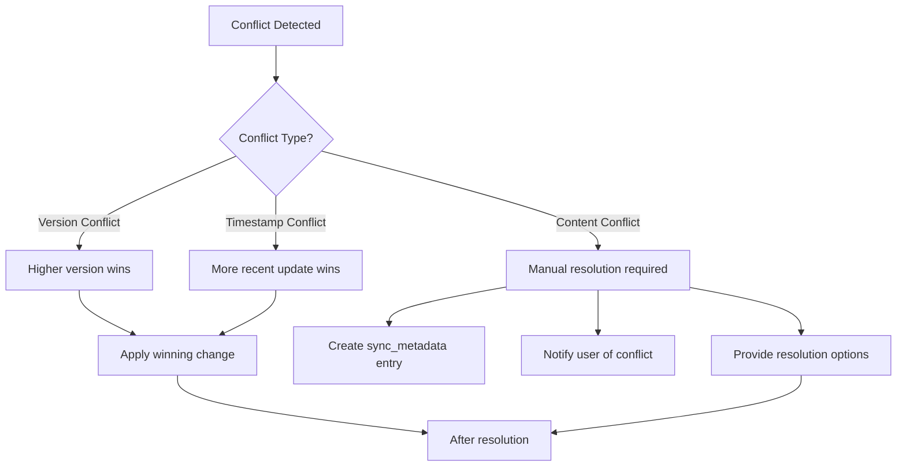

# Isar to Supabase Sync Schema Documentation

## 🎯 Overview

This document provides a comprehensive visual representation and documentation of the database schema needed to sync the local Isar file per individual to the Supabase backend for sync functionality in the Flutbook application.

## 📋 Current Isar Database Structure Analysis

Based on the analysis of the Isar database models, the current local database contains the following collections:

### 1. **UserProfileModel**
- Stores user profile information
- Fields: `id`, `internalId`, `email`, `displayName`, `authMethod`, `syncEnabled`, `lastSyncAt`, `localLibraryPath`

### 2. **AudiobookModel**
- Stores audiobook metadata
- Fields: `id`, `internalId`, `title`, `author`, `album`, `coverArtPath`, `durationInMs`, `filePath`, `chapters`, `createdAt`, `lastPlayedAt`, `completed`, `totalSize`
- Contains embedded `ChapterModel` objects

### 3. **ChapterModel** (Embedded)
- Stores chapter information within audiobooks
- Fields: `id`, `title`, `startTimeInMs`, `endTimeInMs`

### 4. **PlaybackSessionModel**
- Stores current playback session information
- Fields: `id`, `audiobookId`, `currentPositionInMs`, `playbackSpeed`, `isPlaying`, `lastPlayedAt`, `sleepTimerActive`, `sleepTimerDurationInMs`

### 5. **PlaybackHistoryModel**
- Stores playback history and positions
- Fields: `id`, `audiobookId`, `positionInMs`, `durationInMs`, `playedAt`

### 6. **LibraryModel**
- Stores library metadata
- Fields: `id`, `internalId`, `name`, `path`, `audiobookIds`, `lastScanAt`, `totalAudiobooks`, `totalDurationInMs`

## 🔧 Supabase Sync Schema Design

### Core Tables for Sync Functionality



## 📊 Detailed Schema Documentation

### 1. Users Table

```sql
CREATE TABLE users (
    id UUID PRIMARY KEY DEFAULT gen_random_uuid(),
    email TEXT NOT NULL UNIQUE,
    display_name TEXT,
    auth_method TEXT NOT NULL, -- email_password, google_oauth, anonymous
    sync_enabled BOOLEAN DEFAULT TRUE,
    last_sync_at TIMESTAMP WITH TIME ZONE,
    local_library_path TEXT,
    created_at TIMESTAMP WITH TIME ZONE DEFAULT NOW(),
    updated_at TIMESTAMP WITH TIME ZONE DEFAULT NOW()
);
```

**Purpose**: Stores user profile information and sync preferences
**Sync Strategy**: This table is primarily managed by Supabase Auth, but we extend it with custom user metadata

### 2. Audiobooks Table

```sql
CREATE TABLE audiobooks (
    id UUID PRIMARY KEY DEFAULT gen_random_uuid(),
    user_id UUID REFERENCES auth.users(id) ON DELETE CASCADE NOT NULL,
    title TEXT NOT NULL,
    author TEXT,
    album TEXT,
    cover_art_path TEXT,
    duration_ms INTEGER NOT NULL,
    file_path TEXT NOT NULL,
    created_at TIMESTAMP WITH TIME ZONE DEFAULT NOW(),
    last_played_at TIMESTAMP WITH TIME ZONE,
    completed BOOLEAN DEFAULT FALSE,
    total_size INTEGER NOT NULL,
    updated_at TIMESTAMP WITH TIME ZONE DEFAULT NOW(),
    sync_status TEXT DEFAULT 'pending', -- pending, synced, error, conflict
    sync_version INTEGER DEFAULT 1,
    is_deleted BOOLEAN DEFAULT FALSE,
    deleted_at TIMESTAMP WITH TIME ZONE
);
```

**Purpose**: Stores audiobook metadata for sync across devices
**Sync Strategy**: Full sync with conflict resolution based on sync_version

### 3. Chapters Table

```sql
CREATE TABLE chapters (
    id UUID PRIMARY KEY DEFAULT gen_random_uuid(),
    audiobook_id UUID REFERENCES audiobooks(id) ON DELETE CASCADE NOT NULL,
    title TEXT DEFAULT '',
    start_time_ms INTEGER DEFAULT 0,
    end_time_ms INTEGER DEFAULT 0,
    chapter_index INTEGER NOT NULL,
    created_at TIMESTAMP WITH TIME ZONE DEFAULT NOW(),
    updated_at TIMESTAMP WITH TIME ZONE DEFAULT NOW()
);
```

**Purpose**: Stores chapter information for audiobooks
**Sync Strategy**: Cascading sync with parent audiobook

### 4. Playback Sessions Table

```sql
CREATE TABLE playback_sessions (
    id UUID PRIMARY KEY DEFAULT gen_random_uuid(),
    user_id UUID REFERENCES auth.users(id) ON DELETE CASCADE NOT NULL,
    audiobook_id UUID REFERENCES audiobooks(id) ON DELETE CASCADE NOT NULL,
    current_position_ms INTEGER DEFAULT 0,
    playback_speed DECIMAL(3,2) DEFAULT 1.0,
    is_playing BOOLEAN DEFAULT FALSE,
    last_played_at TIMESTAMP WITH TIME ZONE DEFAULT NOW(),
    sleep_timer_active BOOLEAN DEFAULT FALSE,
    sleep_timer_duration_ms INTEGER,
    updated_at TIMESTAMP WITH TIME ZONE DEFAULT NOW(),
    sync_status TEXT DEFAULT 'pending',
    sync_version INTEGER DEFAULT 1
);
```

**Purpose**: Stores current playback session information for sync
**Sync Strategy**: Real-time sync with conflict resolution favoring most recent update

### 5. Playback History Table

```sql
CREATE TABLE playback_history (
    id UUID PRIMARY KEY DEFAULT gen_random_uuid(),
    user_id UUID REFERENCES auth.users(id) ON DELETE CASCADE NOT NULL,
    audiobook_id UUID REFERENCES audiobooks(id) ON DELETE CASCADE NOT NULL,
    position_ms INTEGER NOT NULL,
    duration_ms INTEGER NOT NULL,
    played_at TIMESTAMP WITH TIME ZONE DEFAULT NOW(),
    created_at TIMESTAMP WITH TIME ZONE DEFAULT NOW(),
    sync_status TEXT DEFAULT 'pending',
    sync_version INTEGER DEFAULT 1
);
```

**Purpose**: Stores historical playback data for analytics and progress tracking
**Sync Strategy**: Batch sync with deduplication

### 6. Libraries Table

```sql
CREATE TABLE libraries (
    id UUID PRIMARY KEY DEFAULT gen_random_uuid(),
    user_id UUID REFERENCES auth.users(id) ON DELETE CASCADE NOT NULL,
    name TEXT NOT NULL,
    path TEXT NOT NULL,
    last_scan_at TIMESTAMP WITH TIME ZONE,
    total_audiobooks INTEGER DEFAULT 0,
    total_duration_ms INTEGER DEFAULT 0,
    created_at TIMESTAMP WITH TIME ZONE DEFAULT NOW(),
    updated_at TIMESTAMP WITH TIME ZONE DEFAULT NOW(),
    sync_status TEXT DEFAULT 'pending',
    sync_version INTEGER DEFAULT 1
);
```

**Purpose**: Stores library metadata and organization
**Sync Strategy**: Full sync with conflict resolution

### 7. Library Audiobooks (Junction Table)

```sql
CREATE TABLE library_audiobooks (
    id UUID PRIMARY KEY DEFAULT gen_random_uuid(),
    library_id UUID REFERENCES libraries(id) ON DELETE CASCADE NOT NULL,
    audiobook_id UUID REFERENCES audiobooks(id) ON DELETE CASCADE NOT NULL,
    position INTEGER DEFAULT 0,
    added_at TIMESTAMP WITH TIME ZONE DEFAULT NOW(),
    UNIQUE(library_id, audiobook_id)
);
```

**Purpose**: Many-to-many relationship between libraries and audiobooks
**Sync Strategy**: Cascading sync with parent library

### 8. Sync Metadata Table

```sql
CREATE TABLE sync_metadata (
    id UUID PRIMARY KEY DEFAULT gen_random_uuid(),
    user_id UUID REFERENCES auth.users(id) ON DELETE CASCADE NOT NULL,
    entity_type TEXT NOT NULL, -- audiobook, playback_session, etc.
    entity_id UUID NOT NULL,
    operation TEXT NOT NULL, -- create, update, delete
    operation_timestamp TIMESTAMP WITH TIME ZONE DEFAULT NOW(),
    status TEXT DEFAULT 'pending', -- pending, completed, error
    error_message TEXT,
    retry_count INTEGER DEFAULT 0,
    created_at TIMESTAMP WITH TIME ZONE DEFAULT NOW(),
    updated_at TIMESTAMP WITH TIME ZONE DEFAULT NOW()
);
```

**Purpose**: Tracks sync operations for reliability and debugging
**Sync Strategy**: Internal tracking table, not synced to client

## 🔐 Row Level Security (RLS) Policies

```sql
-- Enable RLS for all tables
ALTER TABLE audiobooks ENABLE ROW LEVEL SECURITY;
ALTER TABLE chapters ENABLE ROW LEVEL SECURITY;
ALTER TABLE playback_sessions ENABLE ROW LEVEL SECURITY;
ALTER TABLE playback_history ENABLE ROW LEVEL SECURITY;
ALTER TABLE libraries ENABLE ROW LEVEL SECURITY;
ALTER TABLE library_audiobooks ENABLE ROW LEVEL SECURITY;
ALTER TABLE sync_metadata ENABLE ROW LEVEL SECURITY;

-- Policies for user data isolation
CREATE POLICY "Users can view own audiobooks" ON audiobooks
  FOR ALL USING (auth.uid() = user_id);

CREATE POLICY "Users can view own chapters" ON chapters
  FOR ALL USING (auth.uid() = (SELECT user_id FROM audiobooks WHERE audiobooks.id = audiobook_id));

CREATE POLICY "Users can view own playback sessions" ON playback_sessions
  FOR ALL USING (auth.uid() = user_id);

CREATE POLICY "Users can view own playback history" ON playback_history
  FOR ALL USING (auth.uid() = user_id);

CREATE POLICY "Users can view own libraries" ON libraries
  FOR ALL USING (auth.uid() = user_id);

CREATE POLICY "Users can view own library audiobooks" ON library_audiobooks
  FOR ALL USING (auth.uid() = (SELECT user_id FROM libraries WHERE libraries.id = library_id));

CREATE POLICY "Users can view own sync metadata" ON sync_metadata
  FOR ALL USING (auth.uid() = user_id);
```

## 🔄 Sync Strategy and Conflict Resolution

### Sync Metadata Fields

All syncable tables include these fields:
- `sync_status`: Tracks sync state (pending, synced, error, conflict)
- `sync_version`: Version number for conflict resolution
- `updated_at`: Timestamp for determining most recent changes

### Conflict Resolution Strategy

1. **Version-based resolution**: Higher `sync_version` wins
2. **Timestamp-based resolution**: More recent `updated_at` wins if versions are equal
3. **Manual conflict resolution**: When conflicts occur, create sync_metadata entries for manual review

### Sync Process Flow



## 🚀 Performance Considerations

### Indexing Strategy

```sql
-- Essential indexes for performance
CREATE INDEX idx_audiobooks_user_id ON audiobooks(user_id);
CREATE INDEX idx_audiobooks_title ON audiobooks(title);
CREATE INDEX idx_audiobooks_author ON audiobooks(author);
CREATE INDEX idx_audiobooks_completed ON audiobooks(completed);

CREATE INDEX idx_chapters_audiobook_id ON chapters(audiobook_id);
CREATE INDEX idx_chapters_position ON chapters(chapter_index);

CREATE INDEX idx_playback_sessions_user_id ON playback_sessions(user_id);
CREATE INDEX idx_playback_sessions_audiobook_id ON playback_sessions(audiobook_id);
CREATE INDEX idx_playback_sessions_updated_at ON playback_sessions(updated_at);

CREATE INDEX idx_playback_history_user_id ON playback_history(user_id);
CREATE INDEX idx_playback_history_audiobook_id ON playback_history(audiobook_id);
CREATE INDEX idx_playback_history_played_at ON playback_history(played_at);

CREATE INDEX idx_libraries_user_id ON libraries(user_id);
CREATE INDEX idx_libraries_name ON libraries(name);

CREATE INDEX idx_library_audiobooks_library_id ON library_audiobooks(library_id);
CREATE INDEX idx_library_audiobooks_audiobook_id ON library_audiobooks(audiobook_id);
CREATE INDEX idx_library_audiobooks_position ON library_audiobooks(position);

CREATE INDEX idx_sync_metadata_user_id ON sync_metadata(user_id);
CREATE INDEX idx_sync_metadata_status ON sync_metadata(status);
CREATE INDEX idx_sync_metadata_entity_type ON sync_metadata(entity_type);
```

### Batch Operations

For efficient sync operations:

1. **Batch inserts**: Use Supabase's batch insert capabilities
2. **Bulk updates**: Group related updates together
3. **Pagination**: Implement pagination for large datasets
4. **Delta sync**: Only sync changes since last sync

### Caching Strategy



## 🛡️ Data Isolation and Security

### Anonymous and Development Users Exclusion

```sql
-- Function to check if user should be excluded from sync
CREATE OR REPLACE FUNCTION should_exclude_user() RETURNS BOOLEAN AS $$
BEGIN
    -- Exclude anonymous users
    IF current_user() IS NULL THEN
        RETURN TRUE;
    END IF;

    -- Exclude development users based on email pattern
    IF current_setting('app.current_user_email') LIKE '%@dev.%' THEN
        RETURN TRUE;
    END IF;

    -- Exclude test users
    IF current_setting('app.current_user_email') LIKE '%@test.%' THEN
        RETURN TRUE;
    END IF;

    RETURN FALSE;
END;
$$ LANGUAGE plpgsql SECURITY DEFINER;
```

### User Data Isolation Implementation

```dart
// In Supabase datasources, always check user eligibility before sync
Future<bool> shouldSyncForCurrentUser() async {
    final user = _supabase.auth.currentUser;

    if (user == null) return false;

    // Exclude anonymous users
    if (user.isAnonymous) return false;

    // Exclude development/test users
    if (user.email?.contains('@dev.') == true) return false;
    if (user.email?.contains('@test.') == true) return false;

    // Check if sync is enabled in user profile
    final profile = await getUserProfile();
    return profile.syncEnabled;
}
```

## 📈 Sync Performance Optimization

### 1. Delta Sync Implementation

```sql
-- Get changes since last sync
SELECT * FROM audiobooks
WHERE user_id = $1
AND updated_at > $2
ORDER BY updated_at ASC;
```

### 2. Batch Processing

```dart
// Batch upload example
Future<void> batchUploadAudiobooks(List<AudiobookModel> audiobooks) async {
    final batchSize = 50; // Optimal batch size

    for (var i = 0; i < audiobooks.length; i += batchSize) {
        final batch = audiobooks.sublist(
            i,
            min(i + batchSize, audiobooks.length)
        );

        final data = batch.map((ab) => ab.toJson()).toList();

        await _supabase.from('audiobooks').upsert(data);

        // Small delay to avoid rate limiting
        await Future.delayed(Duration(milliseconds: 100));
    }
}
```

### 3. Conflict Resolution Strategy



## 📁 File Structure for Sync Implementation

```
lib/
├── features/
│   ├── sync/
│   │   ├── data/
│   │   │   ├── datasources/
│   │   │   │   ├── isar_sync_manager.dart
│   │   │   │   ├── supabase_sync_client.dart
│   │   │   │   └── sync_queue.dart
│   │   │   ├── models/
│   │   │   │   ├── sync_metadata_model.dart
│   │   │   │   └── sync_status_model.dart
│   │   │   └── repositories/
│   │   │       └── sync_repository.dart
│   │   ├── domain/
│   │   │   ├── entities/
│   │   │   │   ├── sync_metadata.dart
│   │   │   │   └── sync_status.dart
│   │   │   └── usecases/
│   │   │       ├── check_sync_status.dart
│   │   │       ├── force_sync.dart
│   │   │       ├── resolve_conflicts.dart
│   │   │       └── toggle_sync.dart
│   │   └── presentation/
│   │       ├── providers/
│   │       │   ├── sync_state_provider.dart
│   │       │   └── sync_status_provider.dart
│   │       └── widgets/
│   │           ├── sync_indicator.dart
│   │           ├── sync_settings.dart
│   │           └── conflict_resolver.dart
```

## 🎯 Implementation Recommendations

### 1. Sync Status Monitoring

```dart
// Sync status enum
enum SyncStatus {
    idle,        // No sync in progress
    syncing,     // Sync in progress
    completed,   // Last sync completed successfully
    error,       // Last sync had errors
    conflict,    // Conflicts detected
    offline      // Offline mode
}
```

### 2. Background Sync Service

```dart
class BackgroundSyncService {
    final Isar isar;
    final SupabaseClient supabase;
    final SyncRepository syncRepository;

    BackgroundSyncService({
        required this.isar,
        required this.supabase,
        required this.syncRepository,
    });

    Future<void> startPeriodicSync() async {
        // Sync every 15 minutes when app is in foreground
        // Sync every hour when app is in background
        // Sync immediately on significant changes
    }

    Future<void> syncAllData() async {
        // Implement comprehensive sync logic
        // Handle conflicts, errors, and retries
    }
}
```

### 3. Conflict Resolution UI

```dart
class ConflictResolverDialog extends StatelessWidget {
    final SyncConflict conflict;

    const ConflictResolverDialog({required this.conflict});

    @override
    Widget build(BuildContext context) {
        return AlertDialog(
            title: Text('Sync Conflict Detected'),
            content: Column(
                children: [
                    Text('Conflict in ${conflict.entityType}: ${conflict.entityId}'),
                    // Show local vs remote versions
                    // Provide resolution options
                ],
            ),
            actions: [
                // Keep local, keep remote, merge options
            ],
        );
    }
}
```

## 📊 Summary

This comprehensive schema design provides:

1. **Complete Isar to Supabase mapping** for all entities
2. **Robust sync functionality** with conflict resolution
3. **User data isolation** with RLS policies
4. **Performance optimization** with proper indexing
5. **Exclusion of anonymous/development users** as specified
6. **Comprehensive sync metadata tracking**
7. **Offline-first architecture** with background sync

The schema supports all current Flutbook functionality while providing a solid foundation for future enhancements like real-time collaboration, advanced analytics, and cross-device synchronization.