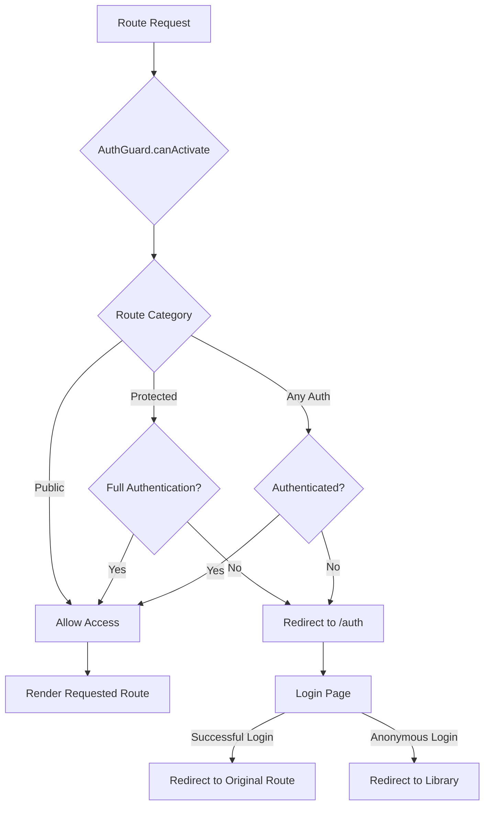

# Auth Guard Flow Diagram

## Flow Explanation

1. **Route Request**: User navigates to any route in the app
2. **AuthGuard Check**: `AuthGuard.canActivate()` evaluates the route
3. **Route Categorization**:
   - Public routes: Always allowed
   - Protected routes: Require full authentication
   - Any Auth routes: Allow authenticated users (including anonymous)
4. **Authentication Check**:
   - For protected routes: Check if user is fully authenticated
   - For any auth routes: Check if user is authenticated (any type)
5. **Access Decision**:
   - Allow access if conditions met
   - Redirect to `/auth` if authentication required
6. **Post-Authentication**:
   - After successful login, redirect to originally requested route
   - After anonymous login, redirect to library

## Key Integration Points

- **AppRouter.generateRoute()**: Main entry point for route validation
- **AuthProvider**: Source of authentication state
- **LoginPage**: Target for authentication redirects
- **AuthGuard**: Core logic for route protection