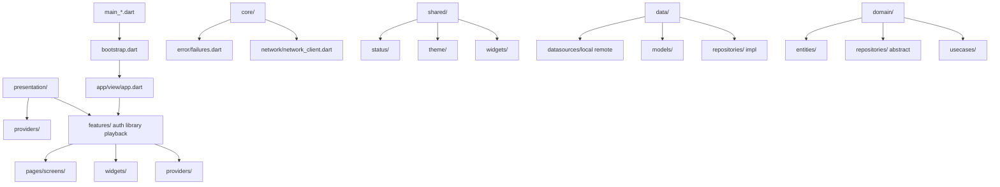

# Flutbook Architecture Alignment Plan

## Current Structure (lib/ directory tree)

```
lib/
├── bootstrap.dart
├── main.dart (and main_production.dart, main_staging.dart, main_development.dart)
├── app/
│   └── view/
│       └── app.dart
├── data/
│   ├── datasources/
│   │   ├── local/
│   │   │   ├── audiobook_local_datasource.dart
│   │   │   ├── error_handler.dart
│   │   │   ├── isar_schema.dart (with .g.dart)
│   │   │   ├── json_storage.dart
│   │   │   └── metadata_extraction_datasource.dart
│   │   └── remote/
│   │       ├── firebase_auth_datasource.dart
│   │       └── firebase_sync_datasource.dart
│   ├── models/ (*.dart and *.g.dart)
│   └── repositories/ (*_repository_impl.dart)
├── domain/
│   ├── entities/ (*.dart)
│   ├── repositories/ (abstract *.dart)
│   └── usecases/ (*.dart)
├── features/
│   └── auth/
│       └── presentation/
│           ├── login.dart
│           ├── views/
│           │   └── login_page.dart
│           └── widgets/ (*.dart)
├── l10n/ (generated and arb)
├── platform/
│   └── audio_service_handler.dart
└── presentation/
    ├── navigation/
    │   └── app_router.dart
    ├── providers/ (*.dart)
    ├── screens/ (*.dart)
    ├── theme/ (*.dart)
    └── widgets/ (*.dart)
```

**Notes:**
- Strong separation of data/domain/presentation layers already exists.
- Generated files: Isar schema (`lib/data/datasources/local/isar_schema.g.dart`), models (*.g.dart), l10n.
- Bootstrap uses Riverpod with custom observer.
- App entry points use `bootstrap` and `UncontrolledProviderScope`.
- pubspec.yaml includes `flutter_riverpod`, `isar`, `very_good_analysis`; dev: `build_runner`, `isar_generator`, `mocktail`.
- analysis_options.yaml includes `very_good_analysis` with minor overrides.
- Basic tests in `test/` (e.g., `app_test.dart` assumed).

## Target very_good_cli Layered Architecture

Align with `very_good create flutter_app` + layers (presentation/data/domain/core/shared), adapted for audiobooks app:



**Key Additions:**
- `core/`: Centralized error handling (e.g., `Failure` base class), network utils, platform-specific logic.
- `shared/`: App-wide reusable components (themes, status enums, common widgets).
- Feature-based organization under `presentation/features/{library,playback,auth,settings}/presentation/{providers,pages,widgets}`.

## Specific Recommendations

### Config Updates
- **pubspec.yaml**:
  - Add `very_good_core: ^1.2.0` (for design_system, error handling).
  - Add `freezed_annotation: ^2.4.1`, `json_annotation: ^4.9.0` (if expanding models for JSON serialization).
  - dev_dependencies: Add `freezed: ^2.5.7`, `json_serializable: ^6.8.0` (if using).
  - Ensure `flutter_test` configures `very_good_test` integration.
- **analysis_options.yaml**: Already good; remove overrides if possible.
- **Build process**: Retain Isar `build_runner build`; add scripts for `dart run build_runner build --delete-conflicting-outputs`.

### File Moves/Adds/Deletes
- **Adds**:
  - `lib/core/error/failures.dart` (base `Failure`, `CacheFailure`, `ServerFailure`).
  - `lib/core/network/network_client.dart` (Dio/HTTP client).
  - `lib/shared/status.dart` (enums: `LibraryStatus`, `PlaybackStatus`).
  - `lib/shared/theme/app_theme.dart` (move from `presentation/theme/`).
  - Expand `presentation/features/{library,playback,settings}/` mirroring auth/.
- **Moves**:
  - `presentation/screens/*` → `presentation/features/{relevant}/presentation/pages/`.
  - `presentation/widgets/*` → `features/*/presentation/widgets/` or `shared/widgets/` if common.
  - `presentation/providers/*` → `features/*/presentation/providers/`.
  - `presentation/theme/*` → `shared/theme/`.
  - `presentation/navigation/app_router.dart` → `core/router/app_router.dart`.
- **Deletes**: None major; deprecate root `presentation/` after moves.
- **Generated**: Ensure `build_runner` for Isar/Freezed.

### Testing & Docs
- Expand `test/`:
  - `test/unit/domain/usecases/`
  - `test/widget/presentation/features/*/`
  - `test/integration/`
- Use `mocktail` for mocks.

## Step-by-Step TODO Checklist for Code Mode

- [ ] Update `pubspec.yaml` with recommended dependencies and run `flutter pub get`.
- [ ] Create `lib/core/` directory and add `error/failures.dart`, `network/network_client.dart`.
- [ ] Create `lib/shared/` and move/add `theme/`, `status/`, common `widgets/`.
- [ ] Reorganize `presentation/` into `features/{auth,library,playback,settings}/presentation/{providers,pages,widgets}`.
- [ ] Move `app_router.dart` to `core/router/`.
- [ ] Add/update docstrings (///) to ALL `.dart` files per guidelines below.
- [ ] Expand tests: Add 1-2 unit tests per usecase/repository; widget tests for screens.
- [ ] Update `bootstrap.dart` and `app.dart` if needed for new providers/router.
- [ ] Run `dart run build_runner build --delete-conflicting-outputs` and fix issues.
- [ ] Verify app builds/runs on all platforms (`flutter run -d chrome/macos` etc.).
- [ ] Update `README.md` with new architecture overview.

## Guidelines for Docstrings
- Place `///` triple-slash docstring at the **top of each `.dart` file** (before imports).
- 1-3 sentences describing:
  - Primary purpose/responsibility of the file.
  - Key classes/functions and their roles.
  - Dependencies on other layers (e.g., "Implements [DomainRepository] using Isar").
- Follow Dart effective style: Capitalize first word, end with period, use active voice.
- Example:
  ```
  /// AudiobookRepositoryImpl provides concrete implementation of AudiobookRepository
  /// using local Isar database and remote Firebase sync. Handles CRUD for audiobooks
  /// including metadata extraction and playback sessions.
  import ...
  ```

This plan minimizes disruption while achieving very_good standards. Total: ~15 new files, 20+ moves, enhanced testing/docs.